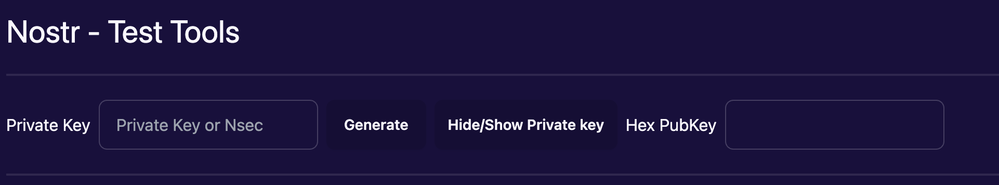
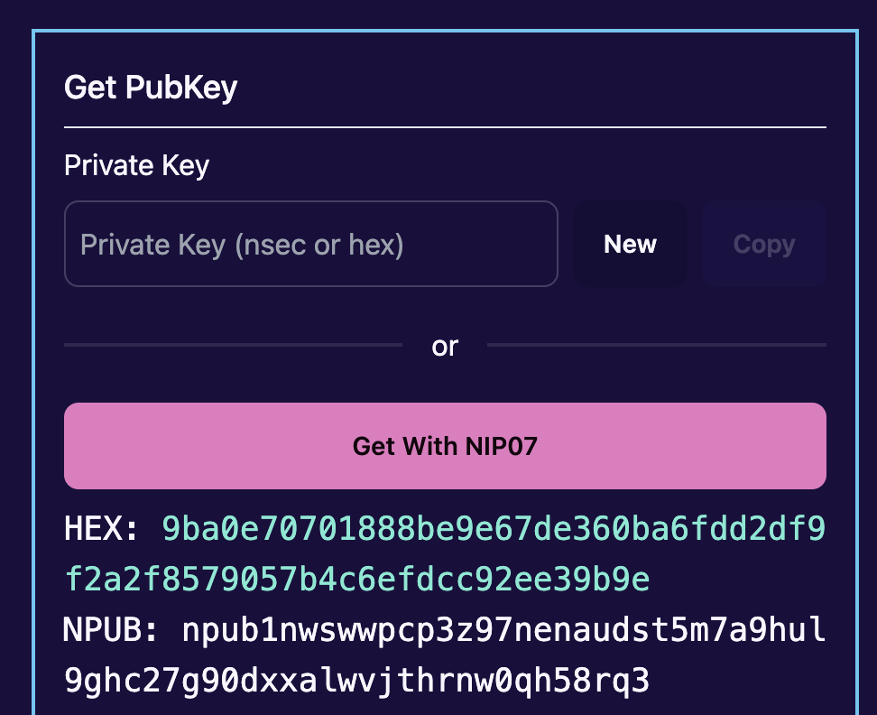
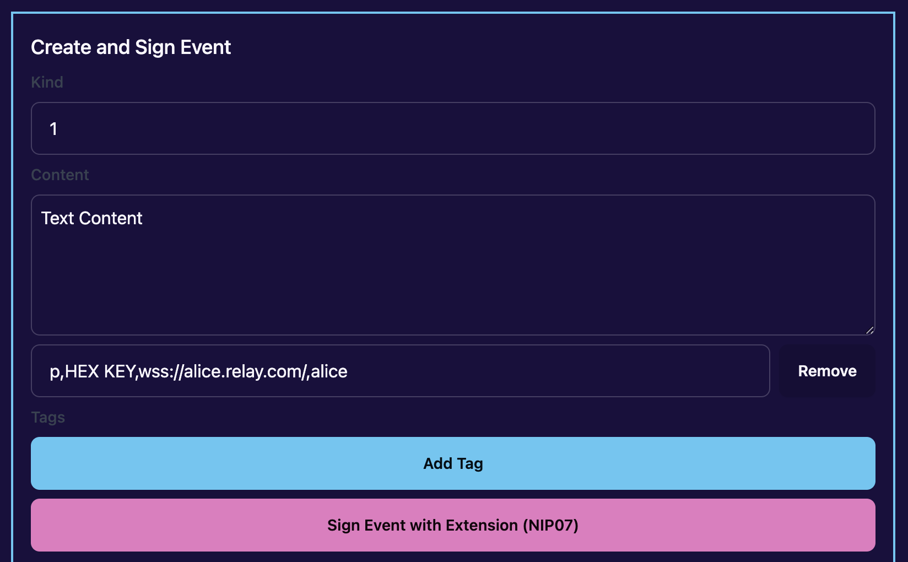
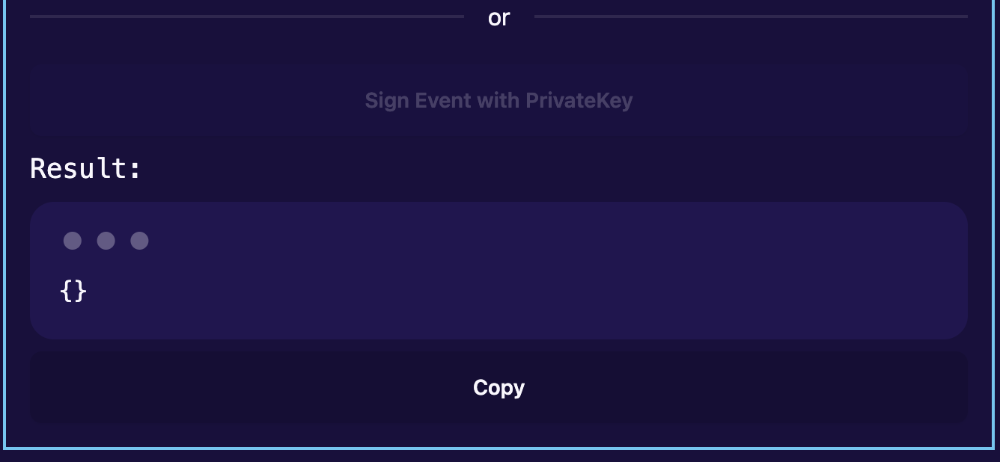

# Nostr Test Tools

## Features

```bash
Nostr can generate private keys, it can also Show or Hide Private keys.
```



```bash
Get your Pubkey for a private key in both hex and nsec format.
You can also get your Pubkey from a NIP07 extension(Get with NIP07).
```



```bash
Here, you can pass an information along that is signed by a public key that can be forged.
Having different event kind(e.g event 1;)
Tags can also be added using the "Add Tag" button
```



```bash
The result shows the Nostr event ( a json object that shows thr kind of event,content, tags, created_at, pubkey, id, sig)
Tags can also be added using the "Add Tag" button
```



## Getting Started

These instructions will get you a copy of the project up and running on your local machine for development and testing purposes.

### Prerequisites

1. [pnpm](https://pnpm.io/)

### Installing

```bash
pnpm install
```

## Developing

Start a development server:

```bash
pnpm run dev

# or start the server and open the app in a new browser tab
pnpm run dev -- --open
```

## Building

To create a production version of your app:

```bash
npm run build
```

You can preview the production build with `npm run preview`.

> To deploy your app, you may need to install an [adapter](https://kit.svelte.dev/docs/adapters) for your target environment.

## Running the tests

```
make test-database
```

## Built With

- [SvelteKit](https://kit.svelte.dev/) - Framework
- [TailwindCSS](https://tailwindcss.com/) - CSS
- [DaisyUI](https://daisyui.com/) - Component Library
- [TypeScript](https://www.typescriptlang.org/)

## Versioning

We use [SemVer](https://semver.org/) for versioning.
